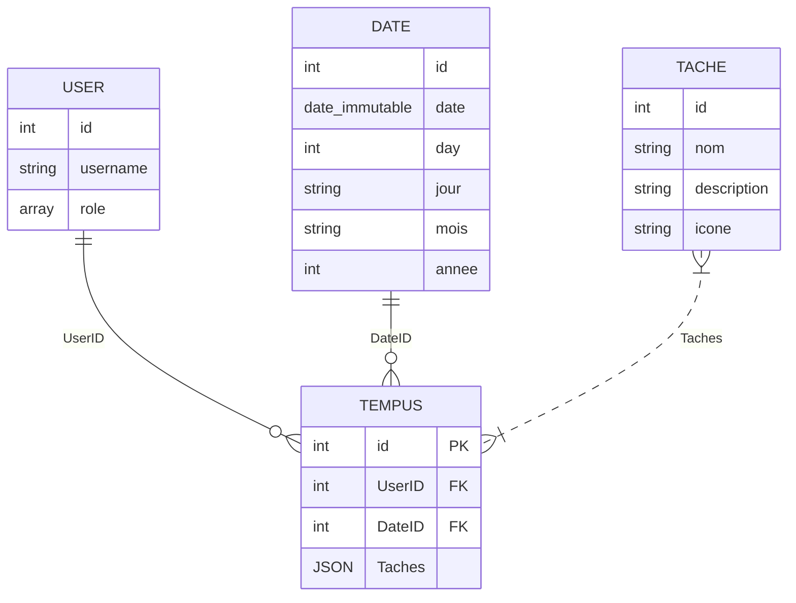

```mermaid
---
title: 
---
erDiagram
    USER ||--o{ TEMPUS : UserID
    DATE ||--o{ TEMPUS : DateID
	TACHE }|..|{ TEMPUS: Taches


    USER {
		int id
        string username
        array role
    }
    TACHE {
		int id
        string nom
        string description
        string icone
    }
	DATE{
		int id
		date_immutable date
		int day
		string jour
		string mois
		int annee
	}
	
	TEMPUS{
		int id PK
		int UserID FK
		int DateID FK
		JSON Taches
	}
```